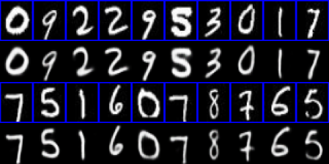

# Variational AutoEncoder Models
A collection of variational autoencoder models, e.g. VAE, CVAE, InfoVAE, MMDVAE in Tensorflow.  

## How to use?
- Command 1: `python train.py vae_name train`  
- Command 2: `python train.py vae_name generate`  
- Command 3: `python train.py vae_name generate path/to/image`  

Note: Generated samples will be stored in `images/{vae_model}/` directory during training.

## Variational Autoencoders

The following papers are just examples on how to use the implemented variational autoencoders.  
We did not mean to implement what have been described in each paper.

- VAE: Vanilla Variational AutoEncoder
	- [Auto-Encoding Variational Bayes, 2014](https://arxiv.org/abs/1312.6114)  
	
- CVAE: Conditional Variational AutoEncoder
	- [Learning Structured Output Representation using Deep Conditional Generative Models, 2016](https://pdfs.semanticscholar.org/3f25/e17eb717e5894e0404ea634451332f85d287.pdf)
	- [An Uncertain Future: Forecasting from Static Images using Variational Autoencoders, 2016](https://arxiv.org/pdf/1606.07873.pdf)  
	
- InfoVAE: Information Variational Autoencoder
	- [Information Maximizing Variational Autoencoders, 2017](https://arxiv.org/abs/1706.02262)  
	
- MMDVAE: Maximum-Mean Discrepancy Variational AutoEncoder
	- [Information Maximizing Variational Autoencoders, 2017](https://arxiv.org/abs/1706.02262)  
	

*Model* | *Loss Function*
:---: | :--- |
**VAE** 	| 
**CVAE**	| 
**InfoVAE**	| 
**MMDVAE**	| 

#### Results for MNIST
The following results can be reproduced with command:  
```
python train.py vae_name train
```
Note: 1st and 3rd rows represent the ground truth whereas the 2nd and 4th rows are the generated ones.

*Name* | *Epoch 1* | *Epoch 15* | *Epoch 30*
:---: | :---: | :---: | :---: |
VAE |  |  | 
CVAE |  |  | 

*Name* | *Epoch 1* | *Epoch 2* | *Epoch 3*
:---: | :---: | :---: | :---: |
InfoVAE |  |  | 
MMDVAE |  |  | 

## Dependencies

1. Install miniconda <https://docs.conda.io/en/latest/miniconda.html>
2. Create an environment 	`conda create --name autoencoder`
3. Activate the environment `source activate autoencoder`
4. Install [Tensorflow] 	`conda install -c conda-forge tensorflow`
5. Install [Opencv] 		`conda install -c conda-forge opencv`
6. Install [sklearn] 		`conda install -c anaconda scikit-learn`
7. Install [matplotlib] 	`conda install -c conda-forge matplotlib`

## Datasets
If you wanna try new dataset, please make sure you make it in the following way:
- Dataset_main_directory
If you wanna try new dataset, please make sure you make it in the following way:
- Dataset_main_directory
	- train_data
		- category_1: (image1, image2, ...)
		- category_2: (image1, image2, ...)
		- ...
	- test_data
		- category_1: (image1, image2, ...)
		- category_2: (image1, image2, ...)
		- ...

The `loader.py` file will automatically upload all images and their labels (category_i folders)

## Acknowledgements
This implementation has been based on the work of the great following repositories:
- https://github.com/hwalsuklee/tensorflow-generative-model-collections
- https://github.com/wiseodd/generative-models
- https://github.com/eriklindernoren/Keras-GAN
- https://github.com/ShengjiaZhao/InfoVAE
